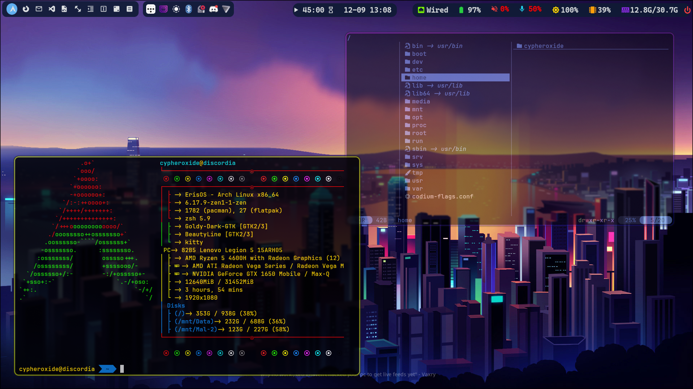
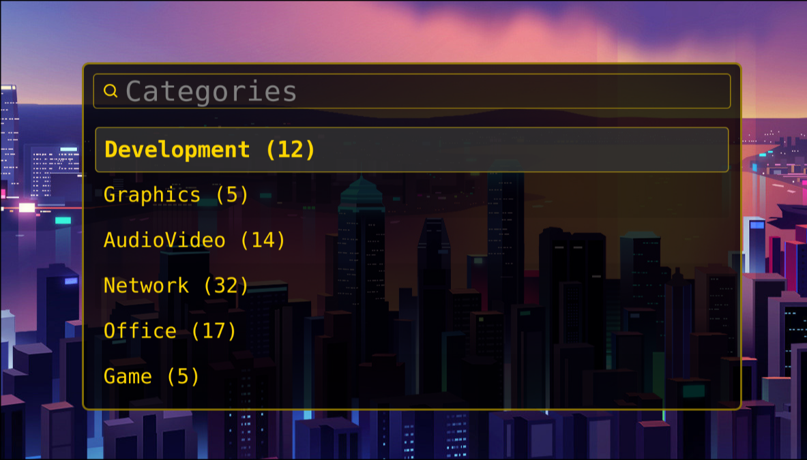

<div align="center">

# Hyprland Configuration for Arch Linux

A comprehensive Hyprland configuration featuring custom scripts, modern tools integration, modularity, and a polished desktop-esque environment setup.


</div>

---

## Overview

This repository contains a production-ready Hyprland configuration optimized for Arch Linux. It includes custom scripts for wallpaper rotation, keybind documentation, monitor management, and a suite of integrated applications.

### Features

- **Dynamic Wallpaper Rotation**: Automatic wallpaper cycling from a curated collection
- **Comprehensive Keybindings**: Well-organized keybinds with built-in help system (`SUPER + /`)
- **Modern Tools Integration**: Waybar, Rofi, Wofi, Kitty, Yazi, and more
- **Custom Scripts**: Monitor switching, FZF-based application launcher, keybind documentation
- **Polished Aesthetics**: Custom theme with transparency, blur effects, and smooth animations
- **Modular Configuration**: Easy to customize with separate config files for different aspects

---

## System Requirements

- **OS**: Arch Linux (or Arch-based distributions)
- **Display Server**: Wayland
- **Compositor**: Hyprland
- **Graphics**: Any GPU with Wayland support (tested with AMD/NVIDIA)

---

## Screenshots

| Desktop | Menu |
|---------|------|
|  |  |

---

## Quick Start

### Installation

1. **Clone the repository**:
   ```bash
   git clone https://github.com/cypheroxide/Hyprland-Arch.git
   cd Hyprland-Arch
   ```

2. **Run the install script**:
   ```bash
   chmod +x install.sh
   ./install.sh
   ```

3. **Log out and select Hyprland** from your display manager

### Manual Installation

If you prefer to install components manually:

```bash
# Install core packages
sudo pacman -S hyprland hyprpaper hyprlock hyprshot \
               waybar rofi wofi dunst kitty \
               pipewire wireplumber \
               wl-clipboard cliphist \
               brightnessctl playerctl \
               network-manager-applet blueman udiskie \
               polkit-gnome gnome-keyring yazi

# Install optional AUR packages (using yay/paru)
yay -S brave-bin sublime-text-4 obsidian

# Backup existing configurations
mkdir -p ~/.config-backup
[ -d ~/.config/hypr ] && mv ~/.config/hypr ~/.config-backup/hypr-$(date +%Y%m%d-%H%M%S)
[ -d ~/.config/waybar ] && mv ~/.config/waybar ~/.config-backup/waybar-$(date +%Y%m%d-%H%M%S)
[ -d ~/.config/kitty ] && mv ~/.config/kitty ~/.config-backup/kitty-$(date +%Y%m%d-%H%M%S)

# Deploy configurations
cp -r config/* ~/.config/
cp -r local/* ~/.local/

# Make scripts executable
chmod +x ~/.config/hypr/Scripts/*.sh
chmod +x ~/.local/bin/*
```

---

## Configuration Structure

```
.
├── config/
│   ├── hypr/                      # Hyprland configuration
│   │   ├── hyprland.conf          # Main config file
│   │   ├── hyprpaper.conf         # Wallpaper configuration
│   │   ├── hyprlock.conf          # Lock screen config
│   │   ├── UserConfigs/           # User-specific settings
│   │   │   ├── 01-UserDefaults.conf    # Environment variables
│   │   │   ├── 02-Hyprlock.conf        # Lock screen settings
│   │   │   ├── 03-keybinds.conf        # Keybindings
│   │   │   ├── 04-monitors.conf        # Monitor configuration
│   │   │   ├── 05-autostart.conf       # Autostart applications
│   │   │   └── 06-window-rules.conf    # Window rules
│   │   ├── Scripts/               # Utility scripts
│   │   │   ├── hyprpaper-rotate.sh     # Wallpaper rotation
│   │   │   ├── switch-monitors.sh      # Monitor profile switcher
│   │   │   ├── fzf-search.sh           # FZF application launcher
│   │   │   └── keybind-help.sh         # Keybind documentation viewer
│   │   ├── hyprpaper/             # Wallpaper collection
│   │   └── themes/                # Theme configuration
│   ├── waybar/                    # Status bar config
│   ├── kitty/                     # Terminal emulator config
│   ├── rofi/                      # Application launcher themes
│   ├── wofi/                      # Alternative launcher
│   ├── yazi/                      # File manager config
│   ├── neofetch/                  # System info config
│   └── autostart/                 # XDG autostart entries
└── local/                         # Local executables
    └── bin/
        └── launch-brave.sh        # Browser launcher script
```

---

## Key Features Explained

### Wallpaper Rotation

Automatically cycles through preloaded wallpapers:

```bash
# Manually trigger rotation
~/.config/hypr/Scripts/hyprpaper-rotate.sh

# Or use the keybinding
SUPER + SHIFT + L
```

Wallpapers are stored in `~/.config/hypr/hyprpaper/` and preloaded in `hyprpaper.conf`.

### FZF Application Launcher

A fast, keyboard-driven application launcher:

```bash
# Launch with
SUPER + S
```

Searches through installed applications and recent files.

### Monitor Management

Switch between monitor profiles:

```bash
# Toggle monitors
SUPER + CTRL + M
```

Edit monitor configurations in `UserConfigs/04-monitors.conf` to suit your setup.

---

## Essential Keybindings

| Keybind | Action |
|---------|--------|
| `SUPER + T` | Open terminal (Kitty) |
| `SUPER + Q` | Close active window |
| `SUPER + M` | Exit Hyprland |
| `SUPER + E` | Open file manager (Yazi) |
| `SUPER + B` | Open browser (Brave) |
| `SUPER + Space` | Open Wofi application menu |
| `SUPER + R` | Open Rofi launcher |
| `SUPER + L` | Lock screen |
| `SUPER + V` | Clipboard manager |
| `SUPER + /` | Show keybind help |
| `SUPER + S` | FZF application search |
| `SUPER + SHIFT + S` | Screenshot region |
| `PRINT` | Screenshot monitor |
| `SUPER + PRINT` | Screenshot window |
| `SUPER + 1-9` | Switch to workspace 1-9 |
| `SUPER + SHIFT + 1-9` | Move window to workspace |
| `SUPER + TAB` | Toggle overview mode |
| `SUPER + A` | Toggle Hyprexpo |
| `SUPER + SHIFT + L` | Rotate wallpaper |

For a complete list, press `SUPER + /` within Hyprland or view `.config/hypr/UserConfigs/03-keybinds.conf`.

**Recommendation**: When updating keybinds, be sure to update `.config/hypr/Scripts/keybind-help.sh` with the updated bindings.

---

## Dependencies

### Core Packages (Arch Linux)

```bash
# Hyprland ecosystem
hyprland hyprpaper hyprlock hyprshot
xdg-desktop-portal-hyprland

# Wayland core
wayland wayland-protocols

# Status bar & launchers
waybar rofi wofi dunst

# Terminal & shell
kitty

# Audio
pipewire pipewire-pulse pipewire-jack wireplumber

# System utilities
brightnessctl playerctl
wl-clipboard cliphist
network-manager-applet blueman
udiskie polkit-gnome gnome-keyring

# File management
yazi ffmpegthumbnailer p7zip jq poppler fd ripgrep fzf imagemagick
```

### Optional AUR Packages

```bash
yay -S brave-bin sublime-text-4 obsidian localsend-bin
```

### Hyprland Plugins (Optional)

Install via `hyprpm`:

- **hyprexpo**: Workspace overview/expo mode
- **hyprfocus**: Window focus effects

```bash
# Install plugins
hyprpm add https://github.com/hyprwm/hyprland-plugins
hyprpm enable hyprexpo
hyprpm enable hyprfocus
hyprpm reload
```

---

## Customization

### Changing Themes

Edit `config/hypr/themes/theme.conf` to modify colors, window decorations, and visual effects. You can also adjust:

- Border colors and sizes in `hyprland.conf`
- Window transparency and blur in the `decoration` section
- Animation curves and timings in the `animations` section

### Adding Wallpapers

1. Add images to `~/.config/hypr/hyprpaper/` or your preferred directory
2. Add preload entries to `hyprpaper.conf`:
   ```
   preload = ~/.config/hypr/hyprpaper/your-wallpaper.jpg
   ```
3. The rotation script will automatically include new wallpapers

### Modifying Keybindings

Edit `.config/hypr/UserConfigs/03-keybinds.conf` and reload Hyprland (`SUPER + M` to exit, then log back in) or run `hyprctl reload`.

### Autostart Applications

Add entries to `.config/hypr/UserConfigs/05-autostart.conf`:
```
exec-once = your-application
```

Or place `.desktop` files in `.config/autostart/`.

### Monitor Configuration

Edit `.config/hypr/UserConfigs/04-monitors.conf`:
```
monitor=HDMI-A-1,1920x1080@60,0x0,1
monitor=eDP-1,1920x1080@144,1920x0,1
```

Find your monitor names with: `hyprctl monitors`

---

## Troubleshooting

### Hyprland won't start

- Check logs: `journalctl --user -xeu hyprland`
- Ensure all dependencies are installed
- Verify your GPU drivers are properly installed

### Wallpaper not changing

- Verify hyprpaper is running: `pgrep hyprpaper`
- Check preloaded wallpapers in `hyprpaper.conf`
- Ensure wallpaper files exist in `~/.config/hypr/hyprpaper/`
- Test manually: `~/.config/hypr/Scripts/hyprpaper-rotate.sh`

### Keybindings not working

- Check for conflicts with other applications
- Verify scripts have execute permissions: `chmod +x ~/.config/hypr/Scripts/*.sh`
- Test scripts manually from terminal
- Check Hyprland config syntax: `hyprctl reload`

### Audio not working

- Check PipeWire status: `systemctl --user status pipewire pipewire-pulse`
- Restart audio services: `systemctl --user restart pipewire pipewire-pulse`
- Check audio device: `wpctl status`

### Screen tearing or performance issues

- Enable VRR if your monitor supports it
- Adjust animation speeds in `hyprland.conf`
- Disable blur or reduce blur passes for better performance

---

## Scripts Documentation

### hyprpaper-rotate.sh

Randomly selects and applies a wallpaper from preloaded images.

**Usage**:
```bash
~/.config/hypr/Scripts/hyprpaper-rotate.sh
```

**Features**:
- Automatically detects all monitors
- Selects from preloaded wallpapers in config
- Waits for hyprpaper to be ready before applying

### switch-monitors.sh

Switches between monitor configuration profiles.

**Usage**:
```bash
~/.config/hypr/Scripts/switch-monitors.sh
```

**Customization**: Edit the script to define your monitor profiles.

### fzf-search.sh

Interactive FZF-based application and file launcher with custom styling.

**Usage**:
```bash
~/.config/hypr/Scripts/fzf-search.sh
```

**Features**:
- Searches installed applications
- Custom Hyprland window rules for popup behavior

### keybind-help.sh

Displays formatted keybinding documentation in a floating terminal.

**Usage**:
```bash
~/.config/hypr/Scripts/keybind-help.sh
```

Automatically parses keybindings from your config file.

---

## Recommended Applications

This configuration works seamlessly with:

- **Terminal**: Kitty (configured), Alacritty, Foot
- **Browser**: Brave (configured), Firefox, Chromium
- **Editor**: Sublime Text (configured), VSCode/-ium, Neovim
- **File Manager**: Yazi (configured), Thunar
- **Image Viewer**: Gwenview, imv
- **Video Player**: MPV, VLC
- **PDF Viewer**: Zathura, muPDF
- **Notes**: Obsidian (configured)

---

## Tips and Tricks

### Performance Optimization

For better performance on lower-end hardware:

1. Reduce blur passes in `hyprland.conf`:
   ```
   blur {
       passes = 1  # Lower this value
   }
   ```

2. Disable transparency:
   ```
   decoration {
       active_opacity = 1.0
       inactive_opacity = 1.0
   }
   ```

3. Simplify animations:
   ```
   animations {
       enabled = false
   }
   ```

### Multi-Monitor Setup

For different monitor arrangements:

1. Get monitor information: `hyprctl monitors`
2. Edit `UserConfigs/04-monitors.conf`
3. Use position values to arrange monitors (e.g., `1920x0` for side-by-side)

### Workspace Management

- Workspaces 1-9 are pre-configured
- Use `SUPER + 1-9` to switch
- Use `SUPER + SHIFT + 1-9` to move windows
- Configure specific app workspaces in `05-autostart.conf`

---

## Contributing

Contributions are welcome! Please feel free to submit issues or pull requests.

1. Fork the repository
2. Create your feature branch: `git checkout -b feature/amazing-feature`
3. Commit your changes: `git commit -m 'Add amazing feature'`
4. Push to the branch: `git push origin feature/amazing-feature`
5. Open a pull request

---

## License

This configuration is provided as-is under the MIT License. Feel free to use, modify, and distribute.

---

## Acknowledgments

- [Hyprland](https://hyprland.org/) - The amazing tiling Wayland compositor
- [Waybar](https://github.com/Alexays/Waybar) - Highly customizable status bar
- [Rofi](https://github.com/davatorium/rofi) - Application launcher and dmenu replacement
- [Kitty](https://sw.kovidgoyal.net/kitty/) - The fast, feature-rich GPU-based terminal
- [Yazi](https://github.com/sxyazi/yazi) - Blazing fast terminal file manager

---

<div align="center">

Made with coffee and insomnia on Arch Linux

</div>
