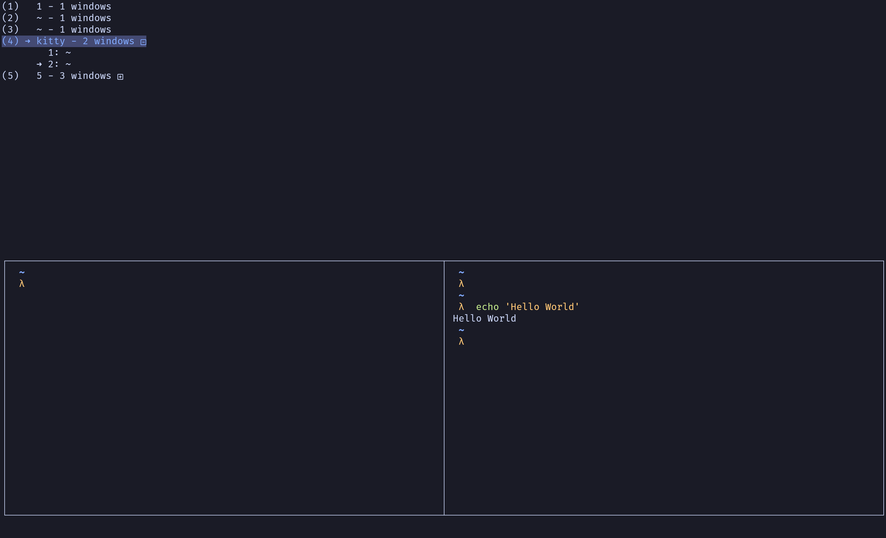

# Kitty-mux
A Custom [kitten](https://sw.kovidgoyal.net/kitty/kittens/custom/) to mimic tmux's multiplexer feature: it enables user to navigate, access, and control kitty tabs or windows to from a single screen.



## Motivation 
[tmux](https://github.com/tmux/tmux) is very useful as a sessions/windows browser for terminal. However, it will become very slow, if you start to do things like opening multiple Neovim instances while running a big project, or just run an AI model like ollama. The [performance](https://github.com/kovidgoyal/kitty) is not very good, even if you run a fast terminal like [alacritty](https://github.com/alacritty/alacritty), which doesn't support tabs/windows by itself.
Therefore, I decided to switch to [kitty](https://github.com/kovidgoyal/kitty), and realized that I could customized a kitten to replace tmux.
This is a tool to give kitty the similar features. The idea is to bind a hotkey to run a tabs/windows browser in kitty so that you can jump to known windows with vim-like key bindings.


## Installation

> [!IMPORTANT]
> This plugin requires kitty v0.42.0 or higher.

```sh
git clone git@github.com:CaeChao/kitty-mux.git ~/.config/kitty/kitty-mux
```

## Configuration
In order to make this plugin work, You'll need to:

* allow remote control in kitty

```conf
allow_remote_control yes
```

* create kitty mappings in your kitty.conf

### Loading projects
Create a mapping for loading projects. The pattern is:

```conf
# ~/.config/kitty/kitty.conf
map ctrl+a>w kitten kitty-mux/tab_switcher.py 
```

Then you can use <ctrl+a> as prefix + w to trigger kitty-mux

### Mappings for tmux-like movements and actions

```conf
# ~/.config/kitty/kitty.conf

# Window/Tab management
tab_bar_style hidden
map ctrl+a>$ set_tab_title " "
enabled_layouts splits:split_axis=horizontal,stack,grid

# Layout
map ctrl+a>space next_layout
map ctrl+a>z toggle_layout stack
map ctrl+a>% launch --location=vsplit --cwd=current
map ctrl+a>shift+' launch --location=hsplit --cwd=current
map ctrl+a>c launch --type=tab --cwd=current
map ctrl+a>t new_tab !neighbor

# Movement
map ctrl+a>h previous_window
map ctrl+a>l next_window
map ctrl+a>j neighboring_window down
map ctrl+a>k neighboring_window up
map ctrl+a>shift+[ move_window left
map ctrl+a>shift+] move_window right

map ctrl+a>p previous_tab
map ctrl+a>n next_tab
map ctrl+a>shift+, move_tab_backward
map ctrl+a>shift+. move_tab_forward

map ctrl+a>x close_window
map ctrl+a>q close_tab

map ctrl+a>1 goto_tab 1
map ctrl+a>2 goto_tab 2
map ctrl+a>3 goto_tab 3
...
```

### Mappings for tmux-like session save and restore

```conf
map ctrl+a>ctrl+r combine : launch kitty -1 --session ~/.config/kitty/kitty-mux/kitty-session : detach_window : close_other_os_windows
map ctrl+a>ctrl+s kitten kitty-mux/save_session.py
```
Create mappings like the one above, then you can combine <ctrl+a> as prefix with <ctrl+s> to save your current working session in Kitty, and later restore them from a terminal(I assume you just use kitty as default), by combining <ctrl+a> as prefix with <ctrl+r>.


### Authorization
You can provide a [kitty remote control password](https://sw.kovidgoyal.net/kitty/conf/#opt-kitty.remote_control_password) by setting your kitty.conf variables like this:
```conf
# ~/.config/kitty/kitty.conf

allow_remote_control password
remote_control_password YOUR_PASSWORD

map ctrl+a>w kitten kitty-mux/tab_switcher.py --password YOUR_PASSWORD

map ctrl+a>ctrl+s kitten kitty-mux/save_session.py --password YOUR_PASSWORD
```


## Features

- Easily view and navigate a list of Tabs, and Windows within Kitty
- Save/Restore tabs like sessions in tmux

## Not Covered
* OS level windows displaying and switching, since the OS level windows won't be able to run in a single screen by Kitty's design, the management of OS level windows should be the responsibilities of a window manager like [i3](https://i3wm.org), [awesomewm](https://awesomewm.org/), or [yabai](https://github.com/koekeishiya/yabai)(MacOS) combines with a window switcher like [Rofi](https://github.com/davatorium/rofi)


## Credit
This custom Kitten is a customized port of [kimlai](https://github.com/kimlai/dotfiles/blob/9dea2453c5bdc96bd2bfa0fe1ea0f8f5b8593b60/kitty/session_switcher.py)

